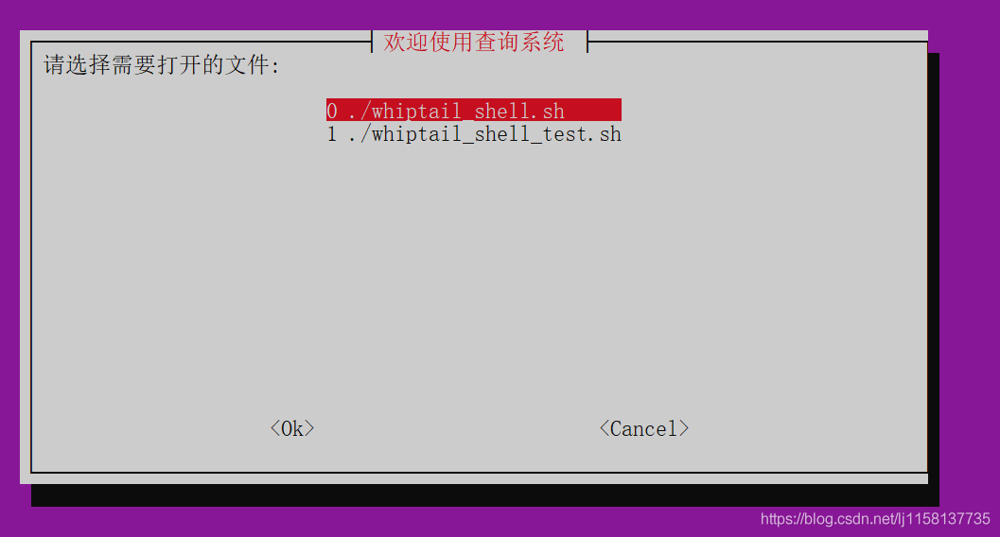

# 基于whiptail和shell脚本的交互式界面

[@官方使用手册](https://linux.die.net/man/1/whiptail)

## 1. 使用背景
在linux环境下开发软件时，有时需要输入一连串的交互命令才能得到我们想要的数据或者结果，而每次我们都要重新输入这些指令，会比较繁琐。如果有一种直观的交互式界面工具来让用户输入关键信息，工具内部隐藏实现细节，是不是更方便、高效呢，本文描述一种在shell脚本中使用whiptail指令来编写交互式界面工具的方法。

## 2. whiptail指令介绍

### 2.1 什么是whiptail

> linux man page 对whiltail的描述为：
> whiptail is a program that will let you present a variety of questions or display messages using dialog boxes from a shell script。（大意为：whiptail是一个允许你使用shell脚本中的对话框呈现各种问题或显示消息的程序）。


### 2.2 whiptail常用语法

 - 在linux终端下输入`whiptail`，可以看到如下输出：
```c
Box options:
        --msgbox <text> <height> <width>
        --yesno  <text> <height> <width>
        --infobox <text> <height> <width>
        --inputbox <text> <height> <width> [init]
        --passwordbox <text> <height> <width> [init]
        --textbox <file> <height> <width>
        --menu <text> <height> <width> <listheight> [tag item] ...
        --checklist <text> <height> <width> <listheight> [tag item status]...
        --radiolist <text> <height> <width> <listheight> [tag item status]...
        --gauge <text> <height> <width> <percent>
Options: (depend on box-option)
        --clear                         clear screen on exit
        --defaultno                     default no button
        --default-item <string>         set default string
        --fb, --fullbuttons             use full buttons
        --nocancel                      no cancel button
        --yes-button <text>             set text of yes button
        --no-button <text>              set text of no button
        --ok-button <text>              set text of ok button
        --cancel-button <text>          set text of cancel button
        --noitem                        don't display items
        --notags                        don't display tags
        --separate-output               output one line at a time
        --output-fd <fd>                output to fd, not stdout
        --title <title>                 display title
        --backtitle <backtitle>         display backtitle
        --scrolltext                    force vertical scrollbars
        --topleft                       put window in top-left corner
        -h, --help                      print this message
        -v, --version                   print version information
```

## 3. whiptail使用实例
### 3.1 使用whiptail实现Box options
#### 3.1.1 msgbox
 - 基本使用方法：`--msgbox <text> <height> <width>`
 - 实例语法：`whiptail --title "welcome"--msgbox "欢迎来到wytaitai的博客!" 10 60`
 - 效果图展示：

#### 3.1.2 yesno
- 基本使用方法：`--yesno  <text> <height> <width>`
- 实例语法：`whiptail --yesno "是否要退出当前界面?" 10 60`
- 效果展示：使用左/右导航键可以选中*yes*/*no*按钮，键入回车键确认选择

#### 3.1.3 inputbox
- 基本使用方法：`--inputbox <text> <height> <width> [init]`
- 实例语法：`whiptail --inputbox "请在此框中进行搜索" 10 60 "whiptail usage"`
- 效果展示：*init*用来默认搜索关键字

#### 3.1.4 passwordbox 
- 基本使用方法：`--passwordbox <text> <height> <width> [init]`
- 实例语法：`whiptail --passwordbox "请输入您的密码:" 10 60 "12345678"`
- 效果展示：使用方法和`inputbox`基本一致

#### 3.1.5 textbox
- 基本使用方法：`--textbox <file> <height> <width>`
- 实例语法：`whiptail --textbox "whiptail_shell.sh" 30 60`
- 效果展示：

#### 3.1.6 menu
- 基本使用方法：`--menu <text> <height> <width> <listheight> [tag item] ...`
- 实例语法：`whiptail --menu "请选择一个文件:" 15 60 4 "1" "whiptail_test1" "2" "whiptail_test2"`
- 效果展示：

#### 3.1.7 gauge 
 - 基本使用方法：`--gauge <text> <height> <width> <percent>`
 - 实例语法：`whiptail --gauge "当前升级进度" 10 60 70`
 - 效果展示：

### 3.2 使用whiptail options，depend on box-option
#### 3.2.1 title
 - 基本使用方法：`--title <title>`
 - 实例语法：`whiptail --title "whiptail 练习" --msgbox "欢迎来到我的博客" 10 60`
 - 效果展示：
 
#### 3.2.2 scrolltext
  - 基本使用方法：`--scrolltext`
  - 实例语法：`whiptail --scrolltext --textbox "whiptail_shell.sh" 30 60`
 - 效果展示：右边垂直进度条，可以按*⬆*/*⬇*进行翻页阅读

### 3.3 配合shell脚本实现用户交互
> 命题：提示用户输入密码登录，密码正确时，显示欢迎界面，密码错误时，提示用户重新输入，并提示剩余尝试次数；登陆系统成功后，在当前目录下查找指定的文件，并将符合条件的文件列举出来供用户选择；用户选择相应的文件后，打开文件，并可以上下翻页查看文件内容；

#### 3.3.1 登陆界面


#### 3.3.2 密码校验界面


#### 3.3.3 搜索界面


#### 3.3.4 搜索结果展示


#### 3.3.5 文件阅览界面
